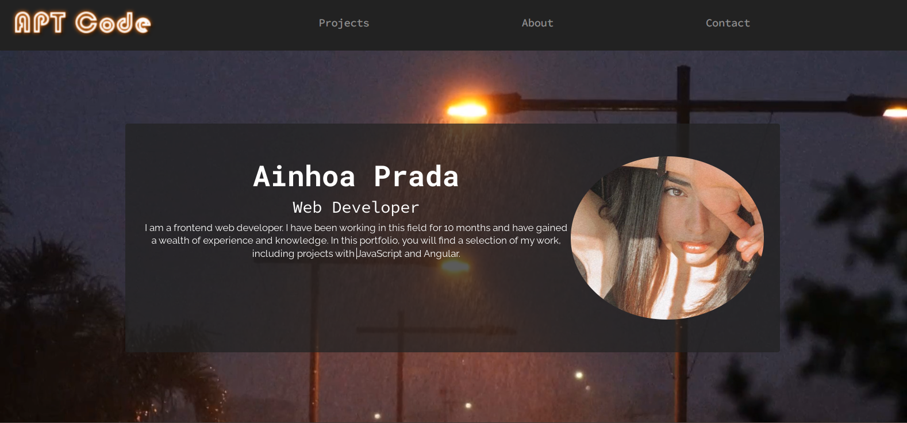
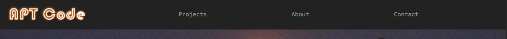
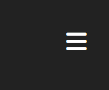
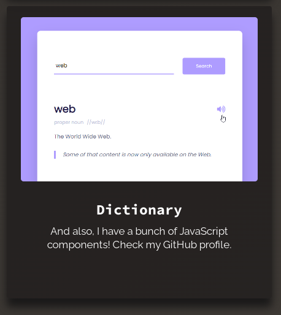

# <Your-Project-Title>

## Description

Welcome to my bootstrap portfolio! Here is a portfolio made with some bootstrap components such as a navigator menu, jumbotron, modal and grid system. 
The content of this project is about myself where you can find some information about some projects I made in the past, my skills and which programming languages I use.
This portfolio is made with the intention of promoting myself for future hires.

    
 

## Table of Contents (Optional)
There are 4 sections on the website:
    -Home: information about me and navigation menu.
    -Projects: some projects I made in the past.
    -About: information about my skills and programming languages.
    -Contact: how to contact me.

## Installation

N/A

## Usage

There are some interactive parts on this website:

On the navigation menu, there are 4 links. The logo will redirect you to home and the other 3 to its respective section.
On phone devices there will be a burger icon for the navigator menu, it is clickable and displays the anchor tags for each section.

    
    

    
    

On the projects section some projects will bring you to the websites I made in the past and others will bring you to my GitHub portfolio where you can check some code repositories.

    
 

On the contact section, icons are clickable and the first one will take you to Linkedin, the second will display a modal with my Gmail details and the third one will take you to my GitHub profile.

    
    
    

## Credits

Bootcamp: UK-VIRT-FE-PT-11-2022-U-LOLC-TWTH-4

## License
MIT License

